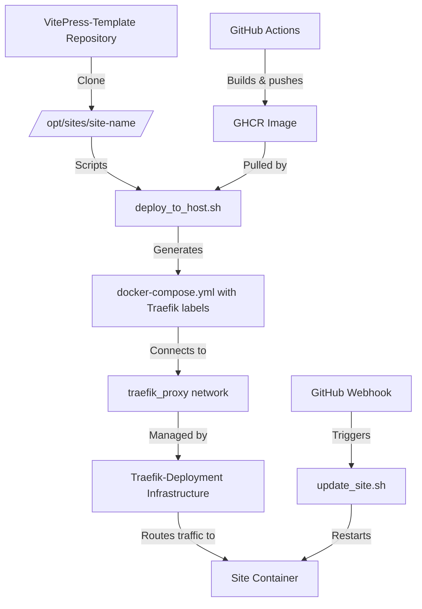

# VitePress-Template — Project Scope & Goals

## 1. Executive Summary

**VitePress-Template** is a generic, production-ready VitePress documentation and portfolio template designed for deployment behind Traefik with automatic HTTPS. This project serves as a reusable foundation for creating documentation sites, personal portfolios, or project wikis that integrate seamlessly with the **Traefik-Deployment** infrastructure.

**Core Principle**: The template is completely domain-agnostic and contains no hardcoded domains, secrets, or site-specific configuration. All customization happens at deployment time through environment variables and content editing.

---

## 2. Project Goals

### 2.1 Primary Goals

1. **Reusable Template**: Provide a clean, well-documented starting point for VitePress-based sites that can be cloned and customized for any use case
2. **Traefik Integration**: Seamless deployment behind Traefik v3 reverse proxy with automatic HTTPS via Let's Encrypt DNS-01 challenge
3. **Docker-First**: Multi-stage Docker builds optimized for minimal image size and production deployment
4. **CI/CD Ready**: Built-in GitHub Actions workflow for automated Docker image builds and deployments to GHCR
5. **Domain Agnostic**: Zero hardcoded configuration—all site-specific values injected at deployment time
6. **Developer Friendly**: Simple local development workflow with hot reload and standard tooling

### 2.2 Secondary Goals

1. Provide comprehensive documentation for both developers and operators
2. Enable webhook-driven automated deployments via GitHub Actions
3. Maintain compatibility with the Traefik-Deployment infrastructure
4. Demonstrate best practices for VitePress configuration and content structure
5. Support multiple deployment patterns (manual, scripted, automated)

---

## 3. Target Audience

### 3.1 Primary Users

- **Individual Developers**: Building personal portfolios or documentation sites
- **Small Teams**: Creating project documentation or internal wikis
- **DevOps Engineers**: Deploying multiple containerized sites behind a single Traefik instance

### 3.2 Prerequisites

Users should have:
- Basic familiarity with Git, Docker, and command-line tools
- A domain managed in Cloudflare (for production deployment)
- A Linux VPS with Traefik already provisioned via Traefik-Deployment
- GitHub account for CI/CD and GHCR image hosting

---

## 4. Technical Scope

### 4.1 Technology Stack

| Component | Technology | Version/Notes |
|-----------|-----------|---------------|
| Framework | VitePress | Latest (vitepress@latest) |
| Languages | TypeScript, Markdown | For config and content |
| Package Manager | Yarn | v1.x compatible |
| Build System | Vite | Via VitePress |
| Runtime | Node.js | v18+ (Alpine in Docker) |
| Web Server | Nginx | Alpine variant for Docker serving |
| Containerization | Docker | Multi-stage builds |
| CI/CD | GitHub Actions | Build and push to GHCR |
| Deployment | Traefik v3 | Via Traefik-Deployment repo |
| TLS | Let's Encrypt | DNS-01 challenge via Cloudflare |

### 4.2 Project Structure

```
VitePress-Template/
├── .github/
│   ├── workflows/
│   │   └── build-and-push.yml      # CI/CD for Docker images
│   └── copilot-instructions.md     # AI agent guidelines
├── docs/
│   ├── .vitepress/
│   │   └── config.ts               # VitePress configuration
│   ├── index.md                    # Homepage content
│   ├── Resume/                     # Example content directory
│   │   └── index.md
│   └── public/
│       └── robots.txt
├── docker/
│   └── docker-compose.yml          # Template for Traefik deployment
├── scripts/
│   ├── bootstrap_site_on_host.sh   # Clone repo to /opt/sites/<name>
│   ├── deploy_to_host.sh           # Generate compose + deploy to Traefik
│   ├── update_site.sh              # Pull latest image + restart
│   └── cleanup.sh                  # Remove site from host
├── Dockerfile                       # Multi-stage build definition
├── package.json                     # Node.js dependencies
├── yarn.lock                        # Dependency lock file
├── README.md                        # Main documentation
├── Quick-Start.md                   # Step-by-step deployment guide
└── PROJECT-SCOPE.md                 # This document
```

### 4.3 Key Features

#### Content & Presentation
- **Sidebar-Only Navigation**: Clean, documentation-focused theme without top navigation
- **Markdown-Based**: All content authored in Markdown with VitePress enhancements
- **Customizable Branding**: Site title, description, and styling configured via `.vitepress/config.ts`

#### Development Workflow
- **Local Dev Server**: Hot-reload development at `http://localhost:5175`
- **Production Build**: Static site generation to `docs/.vitepress/dist`
- **Preview Mode**: Test production build locally before deployment

#### Deployment Architecture
- **Multi-Stage Docker**: Builder stage (Node.js) + Server stage (Nginx Alpine)
- **Environment-Based Config**: All deployment parameters via environment variables
- **Traefik Integration**: Automatic label generation for routing and TLS
- **Zero-Downtime Updates**: Container recreation without service interruption

---

## 5. Integration with Traefik-Deployment

### 5.1 Architectural Relationship



### 5.2 Dependency on Traefik-Deployment

**Required from Traefik-Deployment:**
- Traefik v3 container running on host
- `traefik_proxy` Docker network created
- `~deploy/traefik.env` configured with Cloudflare API token
- Host directory structure: `/opt/traefik` and `/opt/sites`
- `deploy` user with appropriate sudo permissions
- (Optional) Webhook service for automated deployments

**Provided to Traefik-Deployment:**
- Site-specific scripts that follow Traefik-Deployment patterns
- Docker images compatible with Traefik routing
- Properly labeled containers for automatic service discovery

### 5.3 Network Topology

```
Internet
  ↓
Cloudflare (DNS + Proxy, SSL termination)
  ↓ (80/443)
Host Server
  ↓
Traefik Container (ports 8080→80, 8443→443)
  ↓ (traefik_proxy network)
Site Container (VitePress-Template instance, port 80 internal)
```

---

## 6. Deployment Patterns

### 6.1 Manual Deployment (One-Time Setup)

**Phase 1: Repository Creation**
1. Click "Use this template" on GitHub
2. Create new repository (e.g., `company-docs`)
3. Clone and customize content
4. Update `.github/workflows/build-and-push.yml` with new image name
5. Push to `main` → GitHub Actions builds and pushes to GHCR
6. Mark GHCR package as Public

**Phase 2: Host Bootstrap**
```bash
sudo SITE_REPO="https://github.com/user/company-docs.git" \
     SITE_DIR="/opt/sites/docs" \
     /opt/traefik/scripts/bootstrap_site_on_host.sh
```

**Phase 3: Container Deployment**
```bash
sudo SITE_NAME="docs" \
     SITE_HOSTS="docs.example.com" \
     SITE_IMAGE="ghcr.io/user/company-docs:latest" \
     /opt/sites/docs/scripts/deploy_to_host.sh
```

### 6.2 Automated Deployment (CI/CD)

**One-Time Webhook Setup:**
1. Provision webhook service on host: `sudo /opt/traefik/scripts/hooks_provision.sh`
2. Configure GitHub webhook in site repository:
   - URL: `https://hooks.example.com/hooks/deploy-docs`
   - Content type: `application/json`
   - Secret: Value from `WH_SECRET` in `~deploy/traefik.env`
   - Events: **Workflow runs** only

**Automated Flow:**
1. Developer pushes to `main` branch
2. GitHub Actions builds Docker image
3. Image pushed to GHCR
4. GitHub sends `workflow_run` event to webhook
5. Webhook validates HMAC signature
6. Calls `update_site.sh` which pulls new image and restarts container
7. Traefik automatically routes traffic to updated container

### 6.3 Update Workflow

**Manual Update:**
```bash
sudo /opt/traefik/scripts/update_site.sh docs
```

**Automated Update:** (via webhook as described above)

### 6.4 Removal/Cleanup

**Individual Site:**
```bash
sudo /opt/traefik/scripts/remove_site.sh docs
```

**Or using site-specific script:**
```bash
sudo /opt/sites/docs/scripts/cleanup.sh
```

---

## 7. Environment Variables

### 7.1 Deployment-Time Variables

All required at deployment, never hardcoded:

| Variable | Description | Example |
|----------|-------------|---------|
| `SITE_NAME` | Short identifier for the site | `docs` |
| `SITE_HOSTS` | Space-separated domain names | `docs.example.com www.docs.example.com` |
| `SITE_IMAGE` | GHCR image reference | `ghcr.io/user/docs:latest` |
| `TRAEFIK_DIR` | Traefik scripts location | `/opt/traefik` (default) |
| `TARGET_DIR` | Sites directory | `/opt/sites` (default) |
| `NETWORK_NAME` | Docker network name | `traefik_proxy` (default) |

### 7.2 Build-Time Variables (GitHub Actions)

Set automatically by GitHub Actions:
- `GITHUB_TOKEN`: For GHCR authentication
- `github.repository_owner`: For image namespace
- `github.actor`: For Docker login

---

## 8. Security Considerations

### 8.1 Repository Security
- **No Secrets in Code**: All secrets in `~deploy/traefik.env` (mode 0600)
- **No Hardcoded Domains**: Sites work with any domain passed at deployment
- **Public GHCR Packages**: Required for unauthenticated pulls, but code is public anyway

### 8.2 Container Security
- **Multi-Stage Builds**: Minimal attack surface (Nginx Alpine only)
- **Read-Only Filesystem**: Site content served read-only
- **Non-Root User**: Nginx runs as standard user inside container
- **Isolated Network**: Containers communicate only via `traefik_proxy`

### 8.3 TLS/HTTPS
- **Let's Encrypt Certificates**: Automatic issuance and renewal
- **DNS-01 Challenge**: Via Cloudflare API (no port 80 required)
- **Cloudflare Full (Strict)**: End-to-end encryption
- **HTTPS Redirect**: Handled by Traefik

### 8.4 Webhook Security
- **HMAC-SHA256 Validation**: All webhook requests verified
- **Event Filtering**: Only `workflow_run` events accepted
- **Restricted Permissions**: Webhook runs as `deploy` user with limited sudo
- **systemd Isolation**: Webhook service runs outside Docker

---

## 9. Customization & Extension

### 9.1 Content Customization

**Minimal Changes Required:**
1. Edit Markdown files in `docs/` directory
2. Update `.vitepress/config.ts` for site metadata and navigation
3. Replace `docs/public/` assets (favicon, images, etc.)

**Example Customizations:**
- Personal portfolio: Add bio, projects, contact information
- Documentation site: Add guides, API reference, tutorials
- Project wiki: Add team documentation, processes, notes

### 9.2 Visual Customization

**Via VitePress Config:**
```typescript
// docs/.vitepress/config.ts
export default {
  title: 'Your Site Title',
  description: 'Your site description for SEO',
  themeConfig: {
    sidebar: [
      { text: 'Home', link: '/' },
      { text: 'Guide', link: '/guide/' }
    ]
  }
}
```

**Advanced Theming:**
- Override CSS via `.vitepress/theme/custom.css`
- Extend default theme in `.vitepress/theme/index.ts`
- Add custom Vue components

### 9.3 Deployment Customization

**Docker Build:**
- Modify `Dockerfile` for additional build steps
- Change base images (currently `node:18-alpine` and `nginx:alpine`)
- Add runtime dependencies to nginx stage

**Scripts:**
- Customize `scripts/deploy_to_host.sh` for additional labels or configuration
- Modify `scripts/update_site.sh` for pre/post-deployment hooks
- Extend `scripts/cleanup.sh` for additional cleanup tasks

---

## 10. Testing & Validation

### 10.1 Local Testing

**Development:**
```bash
yarn install
yarn docs:dev
# Open http://localhost:5175
```

**Production Build:**
```bash
yarn docs:build
yarn docs:preview
# Verify at http://localhost:4173
```

### 10.2 Docker Testing

**Build Image Locally:**
```bash
docker build -t test-site .
docker run -p 8080:80 test-site
# Open http://localhost:8080
```

### 10.3 Deployment Validation

**After Deployment:**
```bash
# Check container status
docker ps --format "table {{.Names}}\t{{.Status}}\t{{.Ports}}"

# Test HTTP response
curl -I https://docs.example.com

# Verify TLS certificate
curl -vI https://docs.example.com 2>&1 | grep -i "subject\|issuer"

# Check Traefik routing
docker exec traefik wget -qO- http://localhost:8080/api/http/routers
```

---

## 11. Known Limitations & Constraints

### 11.1 Technical Limitations

1. **VitePress Version**: Uses latest VitePress, which may have breaking changes between versions
2. **Node.js Version**: Requires Node.js 18+ for VitePress compatibility
3. **Single-Page Application**: No server-side rendering beyond initial static generation
4. **Static Content Only**: No dynamic backend, database, or user authentication
5. **Traefik Dependency**: Cannot function independently without Traefik infrastructure

### 11.2 Operational Constraints

1. **Cloudflare Required**: DNS-01 challenge requires Cloudflare-managed domains
2. **GHCR Package Visibility**: Packages default to private, manual Public setting required
3. **Docker Network**: Must use `traefik_proxy` network name (or reconfigure)
4. **Host Layout**: Expects standardized `/opt/traefik` and `/opt/sites` structure
5. **Webhook Event Type**: Automated deployments only work with `workflow_run` events

### 11.3 Scaling Limitations

1. **Single Host**: Designed for single-server deployments, not distributed systems
2. **No Load Balancing**: Each site runs as single container (Traefik can route, but no replicas)
3. **Stateless Only**: No built-in persistence layer or session management
4. **Manual Horizontal Scaling**: Multiple sites require manual provisioning

---

## 12. Documentation & Resources

### 12.1 Internal Documentation

- **README.md**: Overview, features, local development, deployment summary
- **Quick-Start.md**: Step-by-step deployment walkthrough with copy-paste examples
- **copilot-instructions.md**: AI agent guidelines for maintaining consistency
- **PROJECT-SCOPE.md**: This document—comprehensive project scope and goals

### 12.2 External Dependencies Documentation

- **Traefik-Deployment**: [https://github.com/joshphillipssr/Traefik-Deployment](https://github.com/joshphillipssr/Traefik-Deployment)
  - README.md: Architecture, provisioning, lifecycle scripts
  - Quick-Start.md: Two-phase setup, webhook configuration
  - copilot-instructions.md: Script patterns, security model

- **VitePress Official**: [https://vitepress.dev](https://vitepress.dev)
- **Traefik Documentation**: [https://doc.traefik.io/traefik/](https://doc.traefik.io/traefik/)
- **Docker Documentation**: [https://docs.docker.com](https://docs.docker.com)

### 12.3 Support & Community

- **Issues**: GitHub Issues on VitePress-Template repository
- **Discussions**: GitHub Discussions (if enabled)
- **Maintainer**: Josh Phillips ([joshphillipssr.com](https://joshphillipssr.com))

---

## 13. Roadmap & Future Enhancements

### 13.1 Potential Features (Not Committed)

- **Alternative Deployment Targets**: Support for other reverse proxies (Caddy, nginx)
- **Multi-Language Support**: i18n configuration examples
- **Additional Themes**: Pre-configured theme variants
- **Search Integration**: Algolia or local search configuration
- **Analytics Templates**: Privacy-friendly analytics setup examples
- **Monitoring**: Prometheus metrics exporter for site health
- **Backup Scripts**: Automated backup and restore for site content

### 13.2 Compatibility Goals

- Maintain compatibility with latest VitePress stable releases
- Keep Docker images minimal and secure
- Preserve backward compatibility with Traefik-Deployment patterns
- Support LTS Node.js versions

---

## 14. Success Criteria

A successful VitePress-Template deployment meets the following criteria:

### 14.1 Functional Requirements

- [x] Local development server runs without errors
- [x] Production build generates static files successfully
- [x] Docker image builds and runs serving static content
- [x] GitHub Actions workflow builds and pushes to GHCR
- [x] Site deploys behind Traefik with automatic HTTPS
- [x] Multiple hostnames route correctly to the same site
- [x] Automated deployments work via GitHub webhooks (if configured)

### 14.2 Quality Requirements

- [x] No hardcoded domains or secrets in repository
- [x] All scripts are idempotent and can be safely re-run
- [x] Documentation is clear and includes copy-paste examples
- [x] Container images are minimal (< 50MB for nginx stage)
- [x] TLS certificates auto-renew without manual intervention
- [x] Zero-downtime updates when pulling new images

### 14.3 Security Requirements

- [x] Secrets stored only in `~deploy/traefik.env`
- [x] Containers run with minimal privileges
- [x] HTTPS enforced via Traefik redirects
- [x] Webhook requests validated with HMAC signatures
- [x] No unnecessary ports exposed to host

---

## 15. Maintenance & Support

### 15.1 Maintenance Responsibilities

**Template Repository:**
- Keep dependencies updated (VitePress, Docker base images)
- Test against new VitePress releases
- Update documentation as patterns evolve
- Respond to issues and pull requests

**Individual Site Repositories:**
- Update content as needed
- Monitor GHCR image builds
- Review GitHub Actions workflow runs
- Maintain domain DNS records in Cloudflare

**Host Infrastructure:**
- Maintain Traefik-Deployment infrastructure
- Monitor webhook service logs
- Rotate Cloudflare API tokens as needed
- Update Docker and Docker Compose

### 15.2 Update Procedures

**Dependency Updates:**
```bash
# Update VitePress and dependencies
yarn upgrade-interactive --latest

# Test locally
yarn docs:dev

# Build and verify
yarn docs:build
yarn docs:preview

# Commit, push → triggers CI/CD
```

**Template Updates:**
1. Pull latest VitePress-Template changes into your site repo
2. Merge carefully, preserving your content customizations
3. Test locally before pushing
4. Push to trigger automated deployment

---

## 16. Glossary

| Term | Definition |
|------|------------|
| **DNS-01 Challenge** | Let's Encrypt validation method using DNS TXT records instead of HTTP |
| **GHCR** | GitHub Container Registry, for hosting Docker images |
| **Traefik** | Modern reverse proxy and load balancer |
| **VitePress** | Static site generator powered by Vite and Vue |
| **traefik_proxy** | Shared Docker network connecting Traefik to all site containers |
| **Cloudflare Proxy** | Cloudflare's CDN and DDoS protection in front of origin server |
| **Multi-Stage Build** | Docker build pattern separating build and runtime stages |
| **Webhook** | HTTP callback for automated deployments triggered by GitHub |
| **ACME** | Automatic Certificate Management Environment (Let's Encrypt protocol) |
| **HMAC** | Hash-based Message Authentication Code for webhook validation |

---

## 17. Conclusion

**VitePress-Template** provides a complete, production-ready foundation for deploying VitePress-based sites as part of a larger Traefik infrastructure. By maintaining strict separation between template code and deployment configuration, it enables rapid creation of new documentation sites while ensuring security, reproducibility, and operational consistency.

The project succeeds when users can:
1. Clone the template
2. Customize content
3. Deploy to a Traefik host
4. Maintain the site through automated CI/CD

All with minimal configuration and maximum reliability.

---

**Document Version**: 1.0  
**Last Updated**: 2026-01-23  
**Maintained By**: Josh Phillips ([joshphillipssr.com](https://joshphillipssr.com))  
**Repository**: [https://github.com/joshphillipssr/VitePress-Template](https://github.com/joshphillipssr/VitePress-Template)
