# VitePress Template

A clean, modern **VitePress**‑based documentation and portfolio site.  The
repository powers [https://joshphillipssr.com](https://joshphillipssr.com) and is
intended as a template for anyone who wants to deploy a static site behind
Traefik with automatically managed certificates via Cloudflare.

This README explains both local development and full deployment using
Docker, Traefik and GitHub Actions.  The deployment instructions assume
Debian 12 on the target server and follow a single, opinionated plan: Docker
runs as root on the host, day‑to‑day operations run as a non‑root `deploy`
user, and Traefik runs as a non‑root process inside its container while
listening on high ports (8080/8443) and publishing host ports 80/443.

---

## 🚀 Features

- ⚡️ Built with [VitePress](https://vitepress.dev)
- 🎨 Clean sidebar‑only theme (no top navigation)
- 📄 Easy Markdown‑based content structure
- 🧱 Designed for personal portfolios, documentation sites or project wikis
- ☁️ Deployment via Docker + Traefik, with automatic HTTPS using Let’s Encrypt
  DNS‑01 challenge through Cloudflare

---

## 🧰 Tech stack

- **Framework:** VitePress (`vitepress@latest`)
- **Languages:** TypeScript / Markdown
- **Package manager:** Yarn
- **Hosting example:** Debian 12 with Docker and Traefik

---

## 🕸️ Network topology

The deployment uses a simple, secure container network managed by Docker:

- **Traefik** runs on the `traefik_proxy` network and listens internally on ports 8080/8443, publishing to host ports 80/443.
- **jpsr-site** (this site) runs as a separate container on the same shared network.
- **Cloudflare** proxies all external traffic and handles DNS + SSL termination with a Let’s Encrypt DNS‑01 challenge via API token.
- Both Traefik and the site container communicate only through the shared network; the host does not expose other services.

```mermaid
flowchart LR
    subgraph Internet
        CF[Cloudflare DNS + Proxy]
    end

    subgraph Host
        direction TB
        subgraph Docker
            T["Traefik Container\nPorts: 8080↔80, 8443↔443"]
            S["Site Container\n(jpsr-site)"]
            NET[(traefik_proxy network)]
        end
    end

    CF <-- 80/443 HTTPS --> T
    T <-- internal Docker network --> S
```



This topology isolates application containers from the host OS, allows Traefik to manage routing and certificates centrally, and ensures encrypted end‑to‑end traffic from browser → Cloudflare → Traefik → site container.

---

## 🏁 Local development

1. **Clone this repository**

   ```bash
   git clone https://github.com/joshphillipssr/joshphillipssr.com.git
   cd joshphillipssr.com
   ```

2. **Install dependencies**

   ```bash
   yarn install
   ```

3. **Start local dev server**

   ```bash
   yarn docs:dev
   ```

4. **Test the local development environment**

   Once the server starts, open your browser and navigate to:

   ```text
   http://localhost:5175
   ```

   You should see the local development version of your site running.

5. **Build for production**

   ```bash
   yarn docs:build
   ```

   The generated static files live in `docs/.vitepress/dist`.

These steps are useful if you want to work on the site’s content or styling.

---

## 🌍 Full deployment workflow

The following procedure sets up a server from scratch, deploys Traefik and
then serves this site via a containerized Nginx instance.  This guide is
opinionated for simplicity; you can always adapt it later.

### 0  Cloudflare prerequisites (one time)

- Create a Cloudflare API token with **Zone.DNS:Edit** and
  **Zone.Zone:Read** for your domain.
- Create `A`/`AAAA` records for `yourdomain.com` and `www` pointing to
  your server’s IP.  Enable the Cloudflare proxy (**orange cloud on**).
- Under *SSL/TLS → Overview* set the mode to **Full (strict)**.

### 1  Prepare the host (one time, as root)

Run the `host_prep.sh` script from the
[Traefik‑Deployment](https://github.com/joshphillipssr/Traefik-Deployment) repo.
It installs Docker and the compose plugin, creates a non‑root operator
account, sets up directory structure and clones the Traefik repo.

```bash
sudo bash -c "$(curl -fsSL \
  https://raw.githubusercontent.com/joshphillipssr/Traefik-Deployment/main/traefik/scripts/host_prep.sh)"
```

What the script does:

- Installs Docker Engine, Buildx and Compose plugin if missing.
- Creates a `deploy` user (or the user specified via `DEPLOY_USER`) and adds
  them to the `docker` group.
- Creates `/opt/traefik` and `/opt/sites` directories owned by `deploy`.
- Clones the Traefik‑Deployment repository into `/opt/traefik` and marks
  its scripts executable.

After running it, **switch to the `deploy` user**:

```bash
su - deploy
```

> **Tip:**  
> If you can’t use `su - deploy` because the account has no password, use:
>
> ```bash
> sudo -iu deploy
> ```
>
> or to run a single command as that user:
>
> ```bash
> sudo -u deploy -- <command>
> ```

### 2  Start Traefik (as `deploy`)

- `CF_API_TOKEN` – your Cloudflare token from step 0.
- `EMAIL` – email for Let’s Encrypt registration and expiry notices.
- `USE_STAGING` – set to `true` if you want to test against Let’s Encrypt’s
  staging environment (avoids rate limits).
- `NETWORK_NAME` – defaults to `traefik_proxy` and rarely needs to be
  overridden.

To start Traefik for the first time, provide these variables inline when running the setup script. This command will automatically create `/opt/traefik/traefik/.env` for future use and launch Traefik via Docker Compose:

```bash
CF_API_TOKEN="your_cf_token_here" \
EMAIL="you@example.com" \
USE_STAGING=false \
/opt/traefik/traefik/scripts/traefik_up.sh
```

The script creates a `.env` file for Traefik, ensures the Docker network
exists, and optionally writes a Compose override to use the staging ACME
endpoint. It will automatically invoke Docker Compose to bring Traefik online.

> **Troubleshooting:**  
> If you see `Permission denied` when running the script, set execute permissions:
>
> ```bash
> chmod +x /opt/traefik/traefik/scripts/*.sh
> ```
>
> If you see a YAML error such as `mapping values are not allowed in this context`, your Traefik compose file is likely outdated or mis‑indented.  
> The latest version in the repo replaces the Nginx example with a correct Traefik v3 configuration. Validate with:
>
> ```bash
> cd /opt/traefik/traefik
> docker compose -f docker-compose.yml config
> ```
>
> On success, you’ll see:
>
> ```bash
> Traefik is up (host 80→8080, 443→8443; staging=false).
> ```
>
> Confirm:
>
> ```bash
> docker ps --format "table {{.Names}}\t{{.Ports}}\t{{.Status}}"
> ```

### 3  Prepare the site (as a sudo‑capable user)

Run this step as your sudo‑capable user (for example, `josh`), since the bootstrap script requires elevated privileges to create directories under `/opt` and adjust permissions. After it finishes, switch back to the `deploy` user for all remaining steps.

```bash
sudo SITE_REPO="https://github.com/joshphillipssr/joshphillipssr.com.git" \
     SITE_DIR="/opt/joshphillipssr.com" \
     bash -c "$(curl -fsSL https://raw.githubusercontent.com/joshphillipssr/joshphillipssr.com/main/scripts/bootstrap_site_on_host.sh)"
```

This step **does not deploy the site container yet**. It only prepares the server by cloning this repository and setting permissions so that the `deploy_to_host.sh` script in the next step can use it to generate the container configuration and start the site.

> **Note:**  
> The script performs privileged actions and may prompt for your password. Once it completes successfully, switch back to the `deploy` user:
>
> ```bash
> sudo -iu deploy
> ```

### 4  Deploy your site (as `deploy`)

This is the step that actually deploys your site container using the Docker image built and published by GitHub Actions.

This step assumes Traefik is already configured with valid Cloudflare credentials.

To deploy the site container behind Traefik, run the `deploy_to_host.sh`
script included in this repository.  You must specify the domain names to
route and the container image tag.  The image is built and published to
GitHub Container Registry (GHCR) via the CI workflow when you push to
`main`.

Run as sudo capable, then switch back:

```bash
sudo SITE_NAME="jpsr" \
     SITE_HOSTS="joshphillipssr.com www.joshphillipssr.com" \
     SITE_IMAGE="ghcr.io/joshphillipssr/jpsr-site:latest" \
     bash /opt/joshphillipssr.com/scripts/deploy_to_host.sh
```

No Cloudflare credentials are required here because Traefik already manages certificate provisioning and renewal.

### 5  CI build & publish (automatic)

A GitHub Actions workflow (`.github/workflows/build-and-push.yml`) builds
this repository into a multi‑architecture Docker image and pushes it to
GHCR on every push to `main`.  On first publication you must set the
package’s visibility to **Public** under your GitHub → Settings →
Packages page.

### 6  Updates (as `deploy`)

Whenever you push changes to `main`, GitHub Actions will build and push
`ghcr.io/joshphillipssr/jpsr-site:latest`.  To pull the new image and
recreate your running container, call the `update_site.sh` script from
Traefik‑Deployment:

```bash
SITE_NAME="jpsr" /opt/traefik/traefik/scripts/update_site.sh
```

This performs a `docker compose pull` and `docker compose up -d` in the
`/opt/sites/<SITE_NAME>` directory.

You can automate this via GitHub Actions by having the action SSH into
the server as `deploy` and run this command after a successful container
build, or via a cron job if you prefer a pull model.

### 7  Removal (as `deploy`)

To stop and remove the container and its Compose files:

```bash
SITE_NAME="jpsr" /opt/traefik/traefik/scripts/remove_site.sh
```

This runs `docker compose down` and deletes `/opt/sites/<SITE_NAME>`.

---

## 🔒 Security & permissions

- The **Docker daemon runs as root**, which is the default on most
  distributions.  You operate it as the non‑root `deploy` user via the
  `docker` group.  If you need stricter isolation, consider installing
  [docker‑socket‑proxy](https://github.com/Tecnativa/docker-socket-proxy)
  and mounting that into Traefik instead of the raw socket.
- **Traefik runs as UID 65532** inside the container and does not need
  root privileges.  Host ports 80/443 are mapped to container ports
  8080/8443 via Docker’s port publishing.
- **ACME data is stored in a volume** (`traefik_acme`) rather than on
  the host filesystem.  Only the `deploy` user can read the `.env`
  containing your Cloudflare token.
- **Least privilege:** The Cloudflare API token must only have
  `Zone.DNS:Edit` and `Zone.Zone:Read` for the zone you’re managing.

---

## 🧩 Credits

This project is maintained by [Josh Phillips](https://joshphillipssr.com).
Feel free to fork it or use it as a template for your own VitePress site.
</file>
