# VitePress Template

A clean, modern **VitePress**‑based documentation and portfolio template. Use
this repo as‑is or click **Use this template** on GitHub to create your own
site repository, then deploy behind an existing Traefik stack.

This README covers what the template is, how to work with it locally, and how
it fits into a Traefik‑based deployment. For a step‑by‑step guide that walks
through creating a new repo (like `joshphillipssr.com`), building the image,
and deploying to a Linux VPS that already runs Traefik from the
Traefik‑Deployment repo, see **Quick-Start.md**.

---

## 🚀 Features

- ⚡️ Built with [VitePress](https://vitepress.dev)
- 🎨 Clean sidebar‑only theme (no top navigation)
- 📄 Easy Markdown‑based content structure
- 🧱 Designed for personal portfolios, documentation sites or project wikis
- ☁️ Deployment via Docker + Traefik, with automatic HTTPS using Let’s Encrypt
  DNS‑01 challenge through Cloudflare

---

## 🧰 Tech stack

- **Framework:** VitePress (`vitepress@latest`)
- **Languages:** TypeScript / Markdown
- **Package manager:** Yarn
- **Hosting example:** Debian 12 with Docker and Traefik

The template keeps domains and secrets out of the codebase—everything is
injected via environment variables at deploy time.

---

## 🕸️ Network topology

The deployment uses a simple, secure container network managed by Docker:

- **Traefik** runs on the `traefik_proxy` network and listens internally on ports 8080/8443, publishing to host ports 80/443.
- **Site container** runs as a separate service on the same shared network.
- **Cloudflare** proxies all external traffic and handles DNS + SSL termination with a Let’s Encrypt DNS‑01 challenge via API token.
- Both Traefik and the site container communicate only through the shared network; the host does not expose other services.

```mermaid
flowchart LR
    subgraph Internet
        CF[Cloudflare DNS + Proxy]
    end

    subgraph Host
        direction TB
        subgraph Docker
            T["Traefik Container\nPorts: 8080↔80, 8443↔443"]
            S["Site Container\n(jpsr-site)"]
            NET[(traefik_proxy network)]
        end
    end

    CF <-- 80/443 HTTPS --> T
    T <-- internal Docker network --> S
```



This topology isolates application containers from the host OS, allows Traefik to manage routing and certificates centrally, and ensures encrypted end‑to‑end traffic from browser → Cloudflare → Traefik → site container.

---

## 🏁 Local development

1. **Clone this repository**

   ```bash
  git clone https://github.com/joshphillipssr/VitePress-Template.git
  cd VitePress-Template
   ```

2. **Install dependencies**

   ```bash
   yarn install
   ```

3. **Start local dev server**

   ```bash
   yarn docs:dev
   ```

4. **Test the local development environment**

   Once the server starts, open your browser and navigate to:

   ```text
   http://localhost:5175
   ```

   You should see the local development version of your site running.

5. **Build for production**

   ```bash
   yarn docs:build
   ```

   The generated static files live in `docs/.vitepress/dist`.

These steps are useful if you want to work on the site’s content or styling.

---

## 🌍 Deployment (overview)

This template is designed to run behind the Traefik stack from the
[Traefik-Deployment](https://github.com/joshphillipssr/Traefik-Deployment) repo.
Deployment is done via Docker images (built by GitHub Actions) and simple host
scripts. The high-level flow is:

- You create your own repository from this template.
- GitHub Actions builds and pushes a Docker image to GHCR.
- On the Traefik host, you bootstrap the repo under `/opt/sites/<name>`.
- You deploy with `scripts/deploy_to_host.sh`, which wires Traefik labels and
  brings the container up on the shared `traefik_proxy` network.

Full, copy/pasteable steps live in [Quick-Start.md](Quick-Start.md).

---

## 🔒 Security & permissions

- The **Docker daemon runs as root**, which is the default on most
  distributions.  You operate it as the non‑root `deploy` user via the
  `docker` group.  If you need stricter isolation, consider installing
  [docker‑socket‑proxy](https://github.com/Tecnativa/docker-socket-proxy)
  and mounting that into Traefik instead of the raw socket.
- **Traefik runs as UID 65532** inside the container and does not need
  root privileges.  Host ports 80/443 are mapped to container ports
  8080/8443 via Docker’s port publishing.
- **ACME data is stored in a volume** (`traefik_acme`) rather than on
  the host filesystem.  Only the `deploy` user can read the `.env`
  containing your Cloudflare token.
- **Least privilege:** The Cloudflare API token must only have
  `Zone.DNS:Edit` and `Zone.Zone:Read` for the zone you’re managing.

---

## 🧩 Credits

This project is maintained by [Josh Phillips](https://joshphillipssr.com).
Feel free to fork it or use it as a template for your own VitePress site.
</file>
